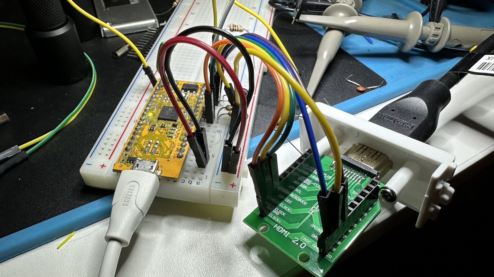

# Pixel Wrangler: HDMI to whatever

The Pixel Wrangler is a tool for converting HDMI video into anything else.
It uses an ice40up5k FPGA to decode the video stream and stores a section
of it in the block RAM, which can then be clocked out of the 16 GPIO pins
in any other format required.

Since the FPGA has total flexibility in how it drives the output pins
it is easily adaptable to different protocols.  Some examples that are possible:

* Classic CRT monitors
* LED matrices
* Flip dots
* LED strips (ws2812 or other protocols)

## Limitations

* Only baseline video is supported (640x480 @ 60Hz)
* 25 MHz maximum pixel clock (maybe improved with better code, but not by very much)
* The amount of the video that can be buffered is limited to 1 Mib (resolutions supported are 1024x1024x1, 512x512x4, 256x256x16 or 256x128x24)
* 3.3V IO on GPIO pins

## Prototyping

A prototype is working on an upduino board with an HDMI breakout adapter.
It's really surprising that it works as well as it does.

## Todo

* [ ] Finish board design
* [ ] DDR on input for slower clock
* [ ] Classic Mac mode
* [ ] LED strip mode
