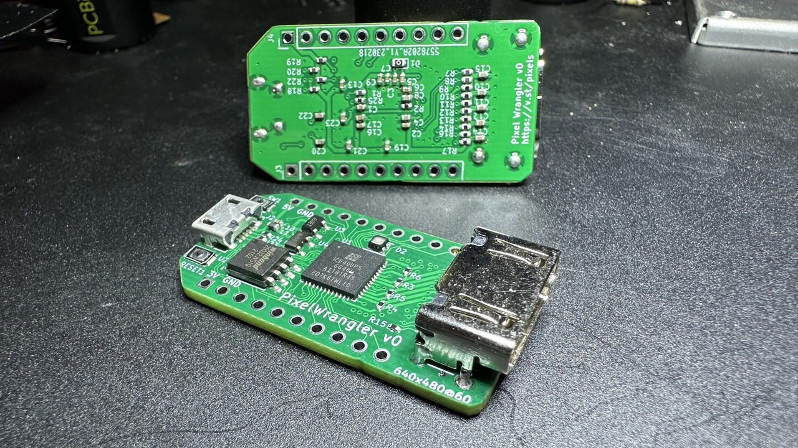
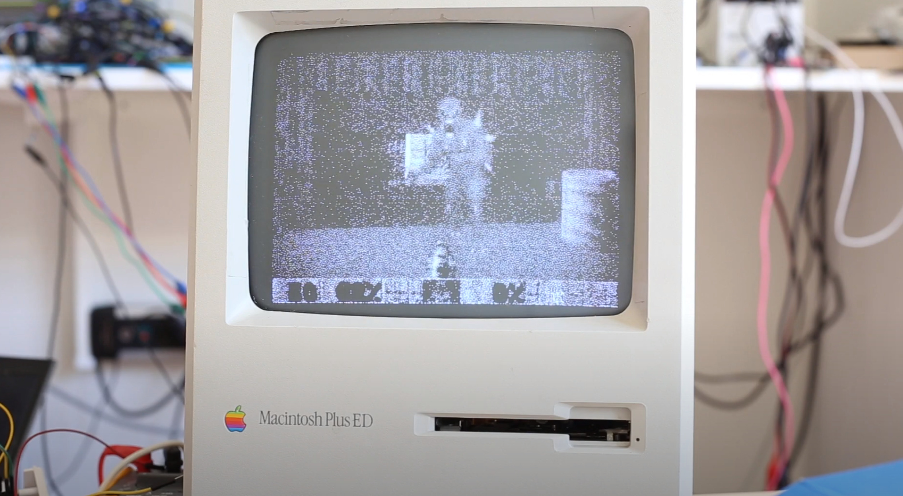
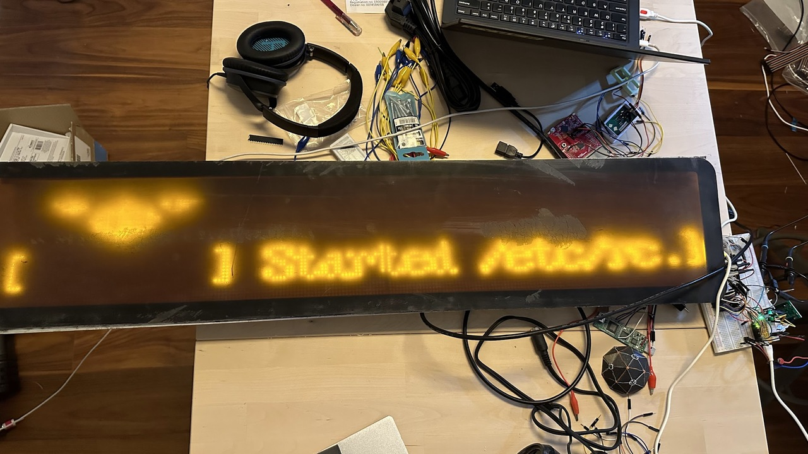
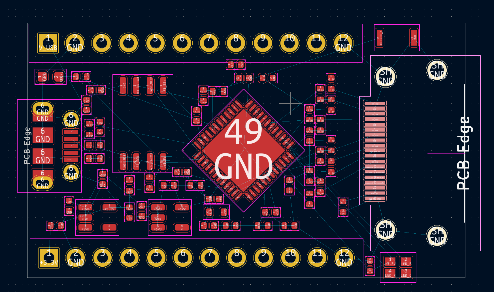
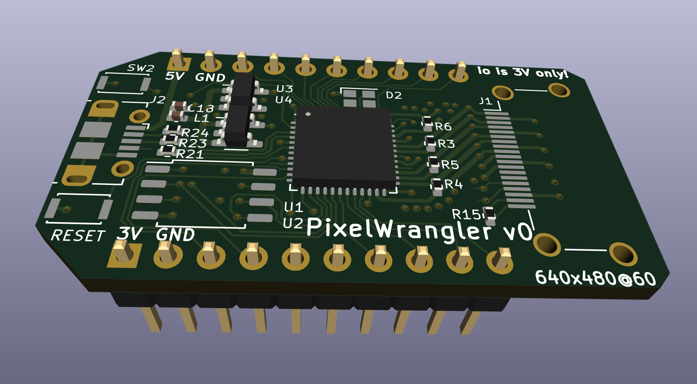
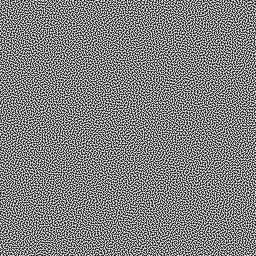

# Pixel Wrangler: HDMI to whatever



The Pixel Wrangler is a tool for converting HDMI video into anything else.
It uses an ice40up5k FPGA to decode the video stream and stores a section
of it in the block RAM, which can then be clocked out of the 16 GPIO pins
in any other format required.

Since the FPGA has total flexibility in how it drives the output pins
it is easily adaptable to different protocols.  Some examples that are possible:

* Classic CRT like the original Mac or Hercules monitors
* LED matrices
* Flip dots
* LED strips (ws2812 or other protocols)
* Lots of servos for "wooden mirrors"

## Does it work?



Mostly! The EDID output is good enough to convince Linux to use it as
a normal, if low-resolution, display.  The `mac.bin` monitor mode has
"*live dithering*" to convert the color display into 1-bit, which
works well enough to [play Doom on a 9" Mac Plus](https://www.youtube.com/watch?v=UI3e4YboR_g)!

With `xrandr` it is possible to
have it use a small section of the primary monitor if you don't want a
separate head:

```
xrandr --output HDMI-2 --pos 350x100
```



There are some [problems with the v0 boards](https://github.com/osresearch/pixel-wrangler/issues/22),
one of which reqiures a bodge wire on the i2c lines.  The 5v pullups on
the source side of the HDMI i2c also might cause problems in the FPGA,
so the boards need some redesign.

The [TMDS D1 and D2 channels aren't working](https://github.com/osresearch/pixel-wrangler/issues/23),
so right now only the blue data on channel D0 is used.
This might be a clock phase issue or it might be a larger problem;
more research is needed.

The USB Micro is directly connected to the ice40up5k and the flash
can be loaded with [TinyFPGA bootloader `pixelwrangler` branch](https://github.com/osresearch/TinyFPGA-Bootloader/tree/pixelwrangler)
to allow new bit streams to be uploaded into the device.
The [`multiboot.bin`](image/multiboot.bin) is prebuilt and can
be flashed with your SPI flasher of choice and then the `bootmeta.json`
and `boardmeta.json` can be written into the flash security pages.

## PCB design



[v0 Schematic](pcb/wrangler_v0.pdf) is based on the [UPduino v3.0 by tinyvision.ai](https://www.tindie.com/products/tinyvision_ai/upduino-v31-low-cost-lattice-ice40-fpga-board/),
heavily modified for this specific application.

The HDMI connector has one differential pair carrying a 25 MHz clock and three differential
pairs running at 250 MHz and carrying 10 bits per pixel.  The clock *must* connect
to the one pin on the ice40up5k that has a LVDS connection to the global clock buffer
so that the pixel clock can be quickly fanned-out to the rest of the logic that uses it.
The three data pairs are routed to the LVDS inputs; D0 and D1 are inverted so that they
don't have to cross on the PCB and must be flipped in the logic.

## Limitations



* Only "baseline video" is supported
  * 640x480 @ 60Hz
  * 25 MHz maximum pixel clock
* 1 Mib frame buffer memory in the ice40. Resolutions supported are:
  * 1024x1024x1
  * 512x512x4
  * 256x256x16
  * 256x128x24
* 3.3V IO on GPIO pins
* No protection against shorts or overcurrent. Be careful!
* Boot loader requires button press to reset
* There isn't any USB support in the bit stream tree yet.

## Dithering



Dithering uses Ordered Blue Noise Dithering. Pattern is from [gao-duan](https://github.com/gao-duan/BlueNoise) (MIT Licensed).
Currently limited to a 64x64 size pattern; ideally a larger RGB
image could be loaded from the SPI flash at boot time, which would
allow three channel dithering without repeating across the screen.

## Todo

* [X] Finish board design -- ordered!
* [X] EDID ROM and i2c interface
* [X] DDR on input for ~~high-res~~ inputs
* [X] Classic Mac mode -- working!
* [ ] Fix TMDS channel D1 and D2 decoding
* [ ] Documentation on writing new interfaces
* [ ] LED strip mode
* [ ] Load larger dithering pattern from flash?
