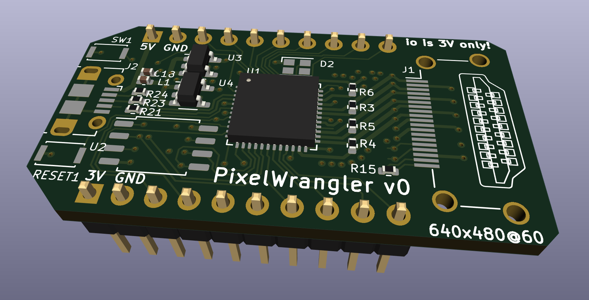
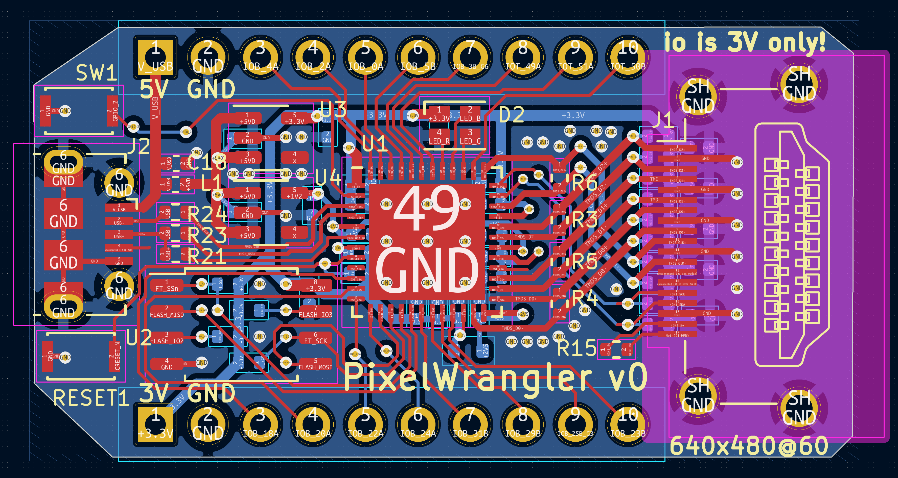

# Pixel Wrangler: HDMI to whatever

The Pixel Wrangler is a tool for converting HDMI video into anything else.
It uses an ice40up5k FPGA to decode the video stream and stores a section
of it in the block RAM, which can then be clocked out of the 16 GPIO pins
in any other format required.

Since the FPGA has total flexibility in how it drives the output pins
it is easily adaptable to different protocols.  Some examples that are possible:

* Classic CRT monitors like B&W Mac or Hercules monitors
* LED matrices
* Flip dots
* LED strips (ws2812 or other protocols)
* Lots of servos for "wooden mirrors"

## PCB design

[v0 Schematic](pcb/wrangler_v0.pdf) is based on the UPduino v3.0 by tinyvision.ai, heavily modified for this application.

## Limitations

* Only "baseline video" is supported
  * 640x480 @ 60Hz
  * 25 MHz maximum pixel clock
  * DDR might make it possible to use higher screen resolution
* 1 Mib frame buffer memory in the ice40. Resolutions supported are:
  * 1024x1024x1
  * 512x512x4
  * 256x256x16
  * 256x128x24
* 3.3V IO on GPIO pins
* No protection against shorts or overcurrent. Be careful!

## Prototyping

A prototype is working on an upduino board with an HDMI breakout adapter.
It's really surprising that it works as well as it does.

## Todo

* [X] Finish board design
* [ ] DDR on input for slower clock
* [ ] Classic Mac mode
* [ ] LED strip mode
